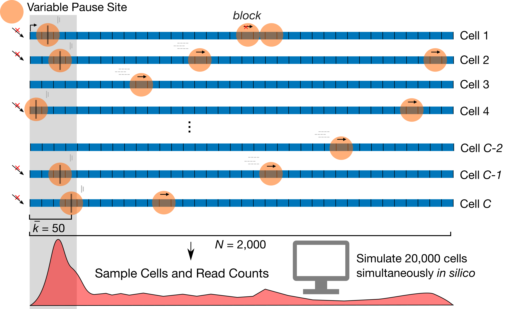

# SimPol — Simulating the dynamics of RNA Polymerase (RNAP) on DNA template

## Overview

SimPol tracks the independent movement of RNAPs along the DNA templates of a large
number of cells. It accepts several key
user-specified parameters, including the initiation rate, pause-escape rate,
a constant or variable elongation rate, the mean and variance of pause sites across cells,
as well as the center-to-center spacing constraint between RNAPs,
the number of cells being simulated, the gene length, and the total time of transcription.
The simulator simply allows each RNAP to move forward or not,
in time slices of $10^{-4}$ minutes, according to the specified position-specific
rate parameters. It assumes that at most one movement of each RNAP can occur per
time slice. The simulator monitors for collisions between adjacent RNAPs, prohibiting
one RNAP to advance if it is at the boundary of the allowable distance from the next.
After running for the specified time, SimPol outputs a file in bigWig format that
records all RNAP position. See more options and details about parameters and outputs
below.

<p align="center">
  
</p>

<p align = "center">
	Fig.1 Design of SimPol (“Simulator of Polymerases”)
</p>


## Dependencies

SimPol is written in the statistical programming language [R](https://www.r-project.org/),
and depends on the [optparse](https://github.com/trevorld/r-optparse), [Matrix](https://cran.r-project.org/web/packages/Matrix/index.html), and [rtracklayer](https://bioconductor.org/packages/release/bioc/html/rtracklayer.html) packages.

Please install all required packages before running SimPol. One way of doing it is
that install all these packages via [conda](https://docs.conda.io/en/latest/),

```
conda create -n simpol -c conda-forge -c bioconda "r-base>=4.0" r-optparse r-matrix bioconductor-rtracklayer
```

Once installed, you can activate the environment then run SimPol within it,

```
conda activate simpol
```

## Usage

```
Usage: ./simPol.R [options]
Simulate RNA polymerase dynamics with transcription parameters.

Options:
	-h, --help
		Show this help message and exit

	-v, --verbose
		Print messages [default]

	-q, --quietly
		Print no messages

	-k INTEGER, --tssLen=INTEGER
		define the mean of pause sites across cells [default 50bp]

	--kSd=DOUBLE
		define the standard deviation of pause sites across cells [default 0]

	--kMin=INTEGER
		upper bound of pause site allowed [default 17bp]

	--kMax=INTEGER
		lower bound of pause site allowed [default 200bp]

	--geneLen=INTEGER
		define the length of the whole gene [default 2000bp]

	-a DOUBLE, --alpha=DOUBLE
		initiation rate [default 1 event per min]

	-b DOUBLE, --beta=DOUBLE
		pause release rate [default 1 event per min]

	-z DOUBLE, --zeta=DOUBLE
		the mean of elongation rates across sites [default 2000bp per min]

	--zetaSd=DOUBLE
		the standard deviation of elongation rates across sites [default 1000]

	--zetaMax=DOUBLE
		the maximum of elongation rates allowed [default 2500bp per min]

	--zetaMin=DOUBLE
		the minimum of elongation rates allowed [default 1500bp per min]

	--zetaVec=CHARACTER
		a file contains vector to scale elongation rates. All cells share the same set of parameters [default NULL]

	-n INTEGER, --cellNum=INTEGER
		Number of cells being simulated [default 10]

	-s INTEGER, --polSize=INTEGER
		Polymerase II size [default 33bp]

	--addSpace=INTEGER
		Additional space in addition to RNAP size [default 17bp]

	-t DOUBLE, --time=DOUBLE
		Total time of simulating data in a cell [default 0.1 min]

	--divergent=LOGICAL
		Generate a bigwig file on the opposite strand, reflecting divergent transcription [default TRUE]

	--auxiliary=LOGICAL
		Generate auxiliary files for sampling or troubleshoot [default TRUE]

	--continue=LOGICAL
		Continue simulations based on existing files from previous round [default FALSE]

	--prefix=CHARACTER
		Prefix for file name [default NULL]

	-d CHARACTER, --outputDir=CHARACTER
		Directory for saving results [default .]

```

## Outputs

After simulation, SimPol produces four files with the same prefix (see Examples) by default:

1. plus.bw is the main bigWig file. It records RNAP positions across all cells
on the positive strand, starting at position 990,000 bp on chr1.
2. minus.bw is an optional bigWig file. It randomly samples 75% of cells from the
simulation, and use them to generate upstream signals on the negative strand. It mimics
the phenomenon of divergent transcription, which is widely seen in mammals.
3. prob_init.RDS is a probability matrix, with shape in (N + 1) states * C cells.
Note N is the user defined gene length, and 1 is the hypothetical state for the free
RNAP. This object is necessary for continuing simulation based on current results.  
4. pos.RDS is a list recording the last 100 steps in simulation. The pos slot records
RNAP positions in each cell, and it's also used to generate the bigWig files above.

The RDS files could be loaded into R via the `readRDS` function.

## Examples

### Example 1

The following command will run a simulation and output the results under the
directory named "test". In the dir, you will see four different outputs, all with
the same prefix, "k50ksd0kmin17kmax200l1950a1b1z2000zsd1000zmin1500zmax2500t0.1n10s33h17",
reminding you what parameters were used. For example, here it simulates n=10 cells,
all with pause site at k=50 bp (downstream of TSS). The pause sites are fixed at a single
position because ksd=0. Initiation and pause release rates are both 1 event per cell per minute.
Elongation rate is set as z=2000 bp per minute on average, with standard deviation z(eta)sd=1000,
maximum speed z(eta)max=2500, and minimum speed z(eta)min=1500. Total gene length is k+l=2000bp. RNAP size is assumed
to be 33bp, with additional spacing equals 17bp. Therefore, the minimum center to
center distance for two adjacent RNAPs would be 50bp. Total transcription time is t=0.1 min
for this test run.  

```
./simPol.R -d test
```

### Example 2

Sometimes, you may realize the total transcription time for your simulation is not sufficient.
So instead of running the simulation from the very beginning, if you output the results
and auxiliary files from the previous round (the default behavior), you can continue
the simulation with the following command:

```
./simPol.R -d test --continue=TRUE
```
Note that the previous results will be overwrited, so you may want to copy your results
from previous round to other places if you want to save them.

### Example 3

The file name is very informative for the parameters being used, but you may think
it's too tedious. You can certainly rename your output files with whatever you like, and
even only output one single bigWig file to save space. The following command will ignore
the auxiliary files and the bigWig file on the opposite strand.

```
./simPol.R -d test --prefix=sim1 --divergent=FALSE --auxiliary=FALSE
```
Note that in this case, since no auxiliary files are saved, it won't be possible to
continue the simulation based on the current round.

### Example 4

User can freely choose any parameters they want for the simulation, like varying pause sites
across cells (by tweaking kSd), setting higher or lower initiation, pause release,
 and/or elongation rates, the number of cells being simulated, etc.

```
./simPol.R -a 10 -b 0.1 -k 50 --kSd=25 -z 1000 --zetaSd=500 --zetaMin=500 -n 100 -d test
```

### Example 5

Alternatively, user can also use a vector to scale the elongation rates. For example,
here I provide a file with 2,000 rows (equal to the length of the gene), and the
values within it will be multiplied by the average elongation rate 2,000 bp per minute.
In this case, the `--zetaSd`, `--zetaMin` and `-zetaMax` will be ignored.

```
./simPol.R -z 2000 --zetaVec=data/elongation_rate.csv -d test
```

### Note

In practice, it may take some time to finish the simulation if there are a few thousands
cells in process simultaneously. For example, when gene length is 2,000 bp, 5,000 cells are simulated,
and total transcription time is 20 min, it may take 2-3 days to get the work done, depending
on other parameters like initiation and pause release rates being used.  

## Citation
Zhao, Y., Liu, L. & Siepel, A. Model-based characterization of the equilibrium dynamics of transcription initiation and promoter-proximal pausing in human cells. 2022.10.19.512929 Preprint at [bioRxiv](https://doi.org/10.1101/2022.10.19.512929) (2022).
